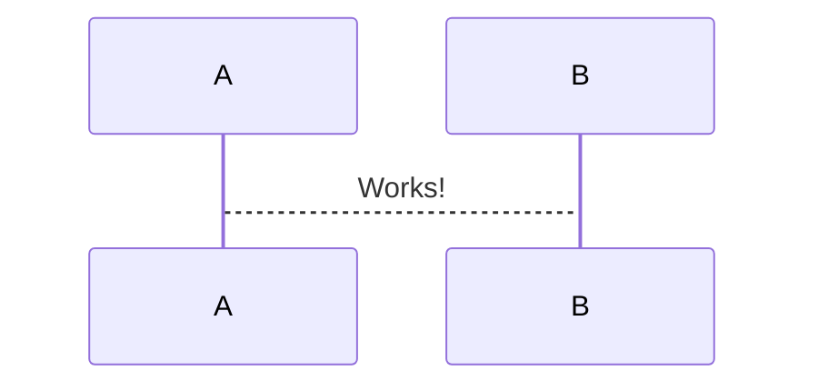
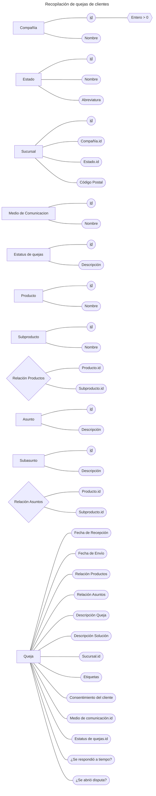

# MCD - Base de Datos Relacionales - Tarea 1

## 1421582 - Claudia Lissette Gutiérrez Díaz

## Diagrama

```mermaid
sequenceDiagram
  A-->B: Works!
```

```mermaid
---
title: Recopilación de quejas de clientes
---

flowchart LR
    Ent1["Compañía"]
    Ent1 --- Atr11([<ins>id</ins>])
    Atr11 --- Dom111{{"Entero > 0"}}
    Ent1 --- Atr12(["Nombre"])
    Ent2["Estado"]
    Ent2 --- Atr21([<ins>id</ins>])
    Ent2 --- Atr22(["Nombre"])
    Ent2 --- Atr23(["Abreviatura"])
    Ent3["Sucursal"]
    Ent3 --- Atr31([<ins>id</ins>])
    Ent3 --- Atr32(["Compañía.id"])
    Ent3 --- Atr33(["Estado.id"])
    Ent3 --- Atr34(["Código Postal"])
    Ent4["Medio de Comunicacion"]
    Ent4 --- Atr41([<ins>id</ins>])
    Ent4 --- Atr42(["Nombre"])
    Ent5["Estatus de quejas"]
    Ent5 --- Atr51([<ins>id</ins>])
    Ent5 --- Atr52(["Descripción"])
    Ent6["Producto"]
    Ent6 --- Atr61([<ins>id</ins>])
    Ent6 --- Atr62(["Nombre"])
    Ent7["Subproducto"]
    Ent7 --- Atr71([<ins>id</ins>])
    Ent7 --- Atr72(["Nombre"])
    Rel67{"Relación Productos"}
    Rel67 --- Atr671(["Producto.id"])
    Rel67 --- Atr672(["Subproducto.id"])
    Ent8["Asunto"]
    Ent8 --- Atr81([<ins>id</ins>])
    Ent8 --- Atr82(["Descripción"])
    Ent9["Subasunto"]
    Ent9 --- Atr91([<ins>id</ins>])
    Ent9 --- Atr92(["Descripción"])
    Rel89{"Relación Asuntos"}
    Rel89 --- Atr891(["Producto.id"])
    Rel89 --- Atr892(["Subproducto.id"])
    Ent10["Queja"]
    Ent10 --- Atr101(["Fecha de Recepción"])
    Ent10 --- Atr102(["Fecha de Envío"])
    Ent10 --- Atr103(["Relación Productos"])
    Ent10 --- Atr104(["Relación Asuntos"])
    Ent10 --- Atr105(["Descripción Queja"])
    Ent10 --- Atr106(["Descripción Solución"])
    Ent10 --- Atr107(["Sucursal.id"])
    Ent10 --- Atr108(["Etiquetas"])
    Ent10 --- Atr109(["Consentimiento del cliente"])
    Ent10 --- Atr1010(["Medio de comunicación.id"])
    Ent10 --- Atr1011(["Estatus de quejas.id"])
    Ent10 --- Atr1012(["¿Se respondió a tiempo?"])
    Ent10 --- Atr1013(["¿Se abrió disputa?"])
```

  